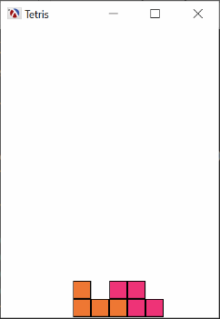

# Tetris

## Screenshot


```racket
#lang racket/gui
(require pict racket/draw racket/contract)
(module+ test (require rackunit)
```
The [contract system](https://docs.racket-lang.org/reference/contracts.html) guards one part of a program from another. We specify the behavior of a module’s exports via (provide (contract-out ....)), and the contract system enforces those constraints.

### 1. Step 1 - define Tetris blocks

- There are 7 shapes in tetris,all of them fit into a 4x4 grid. The blocks will be using letters which roughly resemble their shape (from left to right): I, Q (from square), L, J, T, Z and S. 

- Each block can be defined as a list of strings, with the dot (.) character stating for an empty square and a letter standing for a filled in one

- Using a string representation means that there is a visual cue about the shape of the blocks 
  right in the program source. Racket will also display strings directly, so the results of 
  various functions can be inspected directly into the REPL, without the need to define 
  separate functions to display the data structures.

- Using lists of strings for our blocks has some disadvantages, since Racket cannot validate
  a correct block definition. 
  Before we start writing functions which manipulate these blocks, it is useful to 
  define two validation functions
  ```
   valid-block-row? will check if a single string is valid for a block definition, 
   while valid-block? will verify that a tetris block definition actually conforms to our 
   conventions:
  ```
### Step 2 - draw blocks and add a color to each block
    Use ```pict package ```for graphics. Create a function that takes a block and creates a pict out of it. 
    The signature of the function is as follows
    ``` (define/contract (block->pict block))```
    The graphics representation prints out the tetris block using the entire 4x4 grid. This is not desirable in the final game, but it is useful while developing       ihe application, as we can see how each piece aligns with the rest. Once the application is ready, these grid lines can be removed by using the ghost pict constructor on the rectangle one
